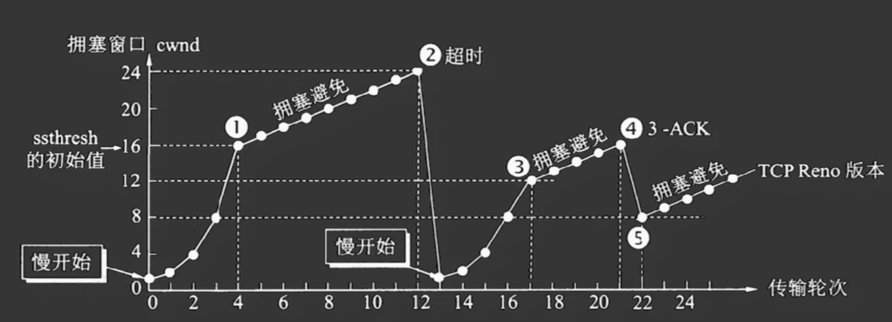

文章链接: https://www.bilibili.com/video/BV1ev4115787/


**文献卡片备注**
　　此卡片为文献卡片。文献卡片使用精炼的语言总结原始文献的内容，并可能带有指向其他卡片的链接。文献卡片不追求完整还原原始文献，建议读者结合此类卡片完整阅读原始文献。


拥塞控制依靠滑动窗口，主要有以下四个算法：

慢开始
: CWIND从1开始指数增长：1，2，4，8……

拥塞避免
: CWIND到达阈值后线性增长。当某一时刻出现超时时，将阈值更新为超时时刻的CWIND的一半，然后重新开始慢开始。

快速重传
:   * 收到乱序包时发送缺失包ID（ACK值为最后一个有序包序列号+1）。
    * 发送方收到三个ACK时无需等待超时就可以知道发生了丢包，并重传。
    * 这里的快速是相对于超时来说的。

快恢复
:   * 发生快速重传后阈值依旧减半，但是直接从新的阈值开始执行拥塞避免算法。
    * 这里的快速是相当于慢开始的。

## 修订记录
2022-10-12T15:24:41+08:00
* 创建。